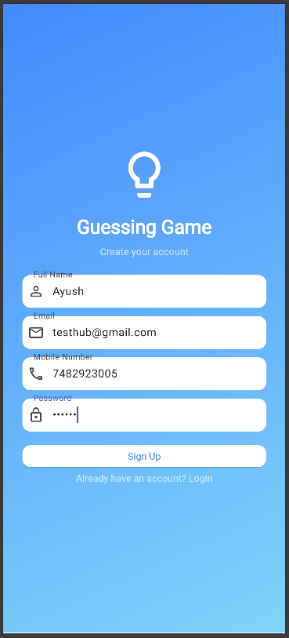
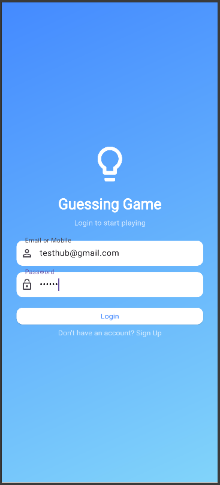
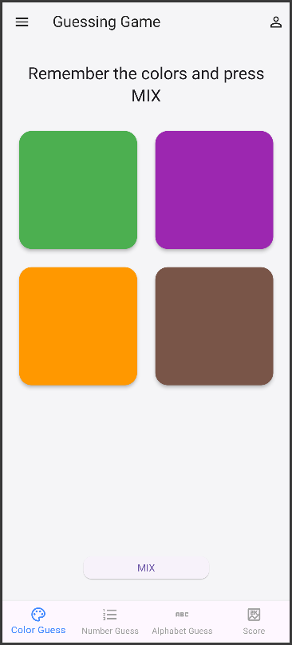
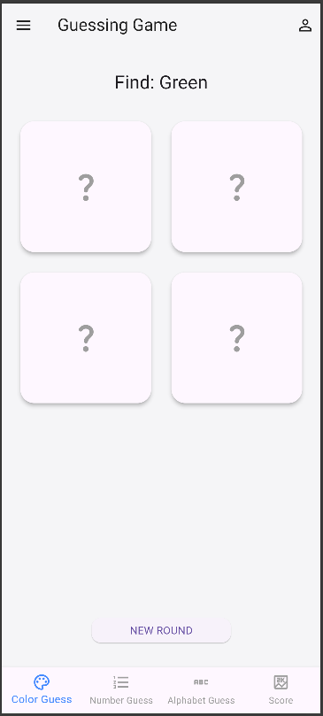
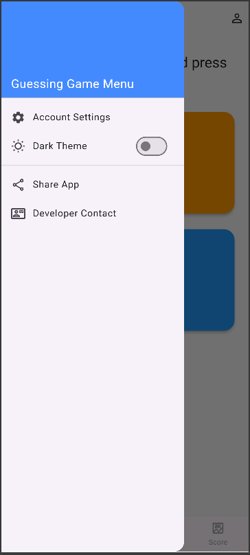
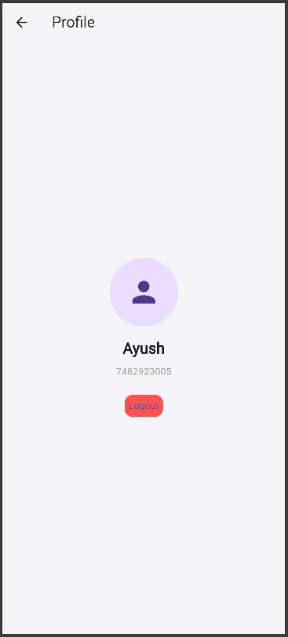
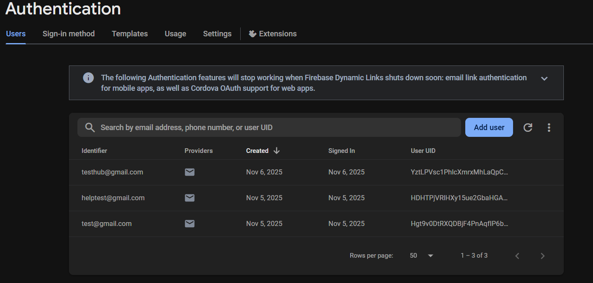

# cardguess

# 🧠 MindMix — A Modern Flutter Guessing Game with Firebase Backend


> **MindMix** is a full-stack, cross-platform memory-based guessing game built using **Flutter** and **Firebase**.  
> It challenges users’ short-term memory through fun mini-games like **Color Guess**, **Number Guess**, and **Alphabet Guess**, with real-time user authentication and cloud data storage.

---

## 📱 Features

- 🎮 **Three Interactive Mini-Games**
  - Color Guess  
  - Number Guess  
  - Alphabet Guess  

- 🌀 **Core Game Logic**
  - "Memorize → Mix → Find" gameplay
  - Visual feedback via SnackBars
  - Dynamic scoring system  

- 🌗 **Modern UI/UX**
  - Clean, minimalist design  
  - Light/Dark theme toggle  
  - Navigation Drawer & Profile Page  

- 🔐 **Firebase Integration**
  - Email/Password Authentication  
  - Real-time session management using `StreamBuilder`  
  - Cloud Firestore NoSQL database for user profiles  

- ⚙️ **State Management**
  - Built using `setState()` for simplicity and clarity  
  - Real-time updates tied to authentication state  

---

## 🏗️ Architecture Overview

### Client (Frontend)
- Built with **Flutter (Dart)**  
- Handles UI rendering, game logic, and state management  

### Backend (Firebase)
- **Firebase Authentication** — for secure login/signup  
- **Cloud Firestore** — for persistent user data (name, email, UID)  
- **Serverless Architecture** — powered by Firebase BaaS  

**Data Flow:**  
`Flutter App` → `Firebase Auth` → `Cloud Firestore` → `Profile Display`

---

## 🧩 Technology Stack

| Category | Technology |
|-----------|-------------|
| Language | Dart |
| Framework | Flutter SDK |
| Backend | Google Firebase |
| Database | Cloud Firestore (NoSQL) |
| Auth System | Firebase Authentication |
| IDE | Android Studio / VS Code |

---

## 🧰 Installation & Setup

### Prerequisites
- Flutter SDK (v3.x or above)
- Firebase Project setup
- Android Studio or VS Code
- Android Emulator or Physical Device

### Steps

1. **Clone the Repository**
   ```bash
   git clone https://github.com/aayushthakur001/MindMix.git
   cd MindMix
   ```

2. **Install Dependencies**
   ```bash
   flutter pub get
   ```

3. **Setup Firebase**
   - Run the following command:
     ```bash
     flutterfire configure
     ```
   - This generates the `firebase_options.dart` file under `lib/`.

4. **Run the App**
   ```bash
   flutter run
   ```

---

## 🕹️ Gameplay Overview

| Phase | Description |
|-------|-------------|
| **Remember** | Players view colored cards (or numbers/alphabets). |
| **Mix** | Cards shuffle and hide. The target to find is displayed. |
| **Find** | Player guesses the correct card. |
| **Score** | Correct guesses increase score; wrong ones show feedback. |

---

## 📸 Screenshots

| Screen | Description |
|--------|--------------|
|  | Gradient-based signup screen |
|  | Gradient-based login screen |
|  | Main Color Guess game UI |
|  | “Mix” state showing hidden cards |
|  | side menue bar page |
|  | Firebase-backed profile page |
|  | Firestore database view |

*(for screenshots check out the `screenshots` folder)*

## 🔐 Firebase Integration Details

- **Authentication**
  ```dart
  await FirebaseAuth.instance
      .createUserWithEmailAndPassword(email: email, password: password);
  ```

- **Firestore Database**
  ```dart
  FirebaseFirestore.instance.collection('users').doc(uid).set({
    'name': userName,
    'email': userEmail,
  });
  ```

- **Session Management**
  ```dart
  StreamBuilder(
    stream: FirebaseAuth.instance.authStateChanges(),
    builder: (context, snapshot) {
      if (snapshot.hasData) return GameHomePage();
      return AuthPage();
    },
  );
  ```

---

## 🧠 Learning Outcomes

- Full-stack mobile app development using **Flutter + Firebase**
- Implemented **real-time auth state listening**
- Mastered **UI design** and **state management**
- Hands-on experience with **NoSQL Firestore databases**
- Practical understanding of **responsive design principles**

---

## 📚 References

- [Flutter Official Docs](https://flutter.dev/docs)  
- [Firebase for Flutter (FlutterFire)](https://firebase.flutter.dev/)  
- [Firebase Authentication](https://firebase.google.com/docs/auth)  
- [Cloud Firestore](https://firebase.google.com/docs/firestore)  
- [Dart Language Guide](https://dart.dev/guides)

---

## 👨‍💻 Developer

**Ayush Kumar Thakur**  
📧 [ayushwork981@gmail.com](mailto:ayushwork981@gmail.com)  
🎓 Chandigarh University, UIC  
🧾 UID: 24MCA20322  
🔗 [GitHub Profile](https://github.com/aayushthakur001)

---

## 🧾 License

This project is licensed under the **MIT License**.  
See the [LICENSE](LICENSE) file for details.

---

## ⭐ Acknowledgments

Special thanks to **Ms. Winky Bhatiya** for her guidance and mentorship throughout the project.
